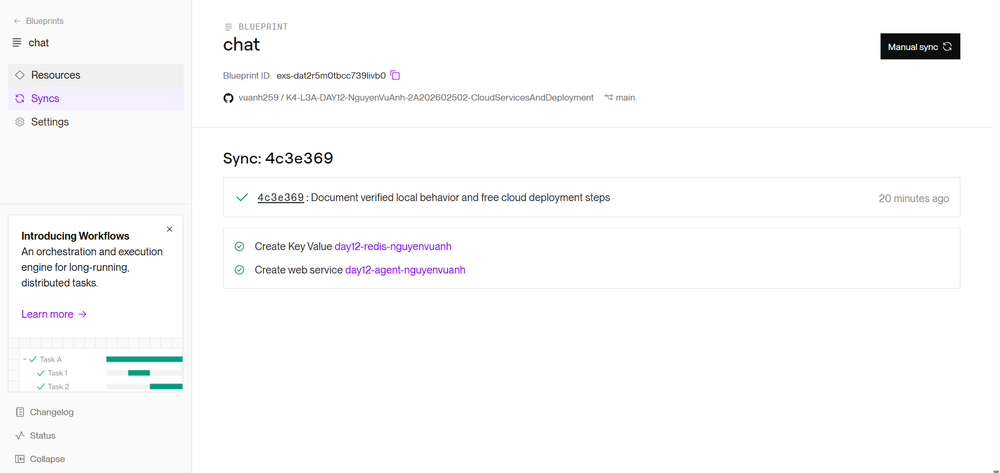
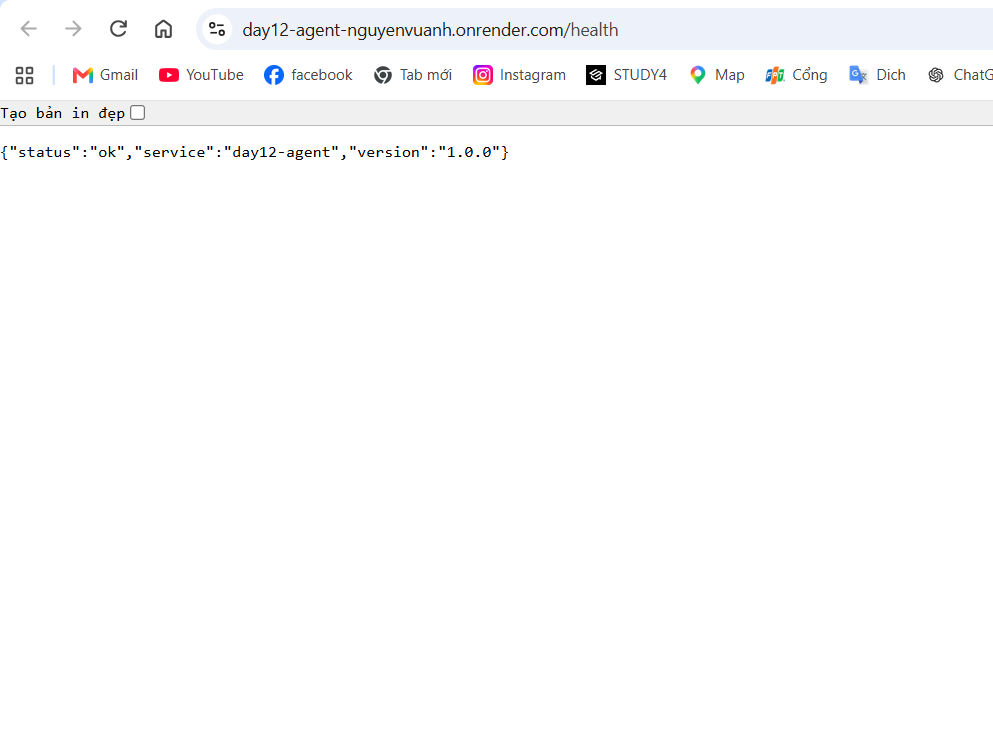
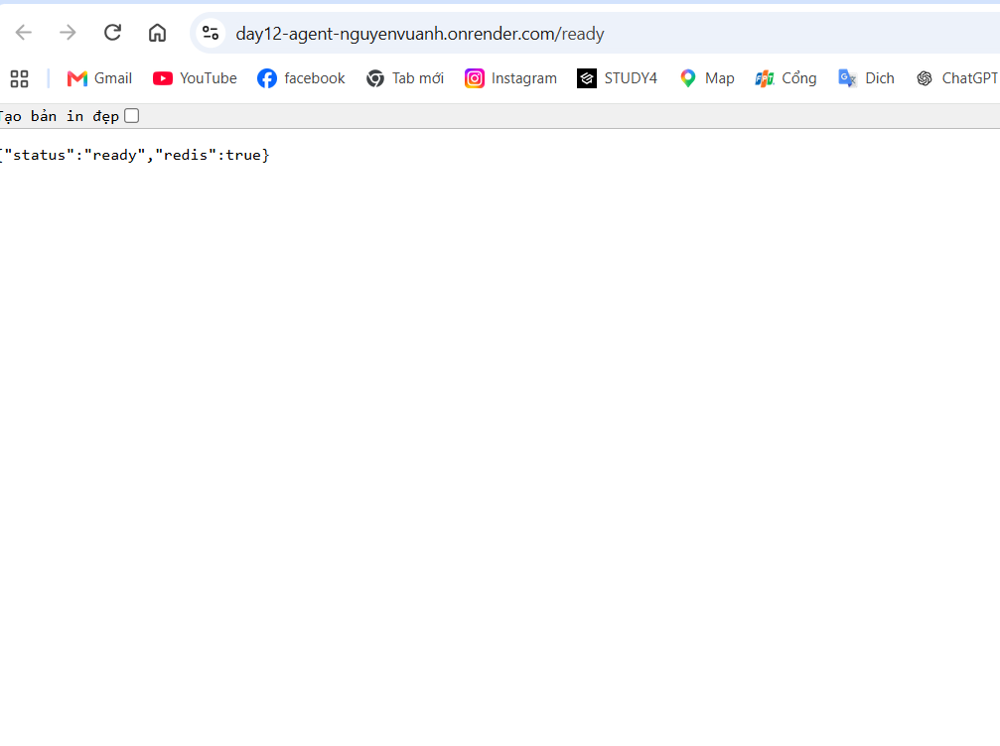

# Thông tin triển khai — CP5

## Học viên

| Mục | Nội dung |
|---|---|
| Họ và tên | Nguyễn Vũ Anh |
| Mã học viên | 2A202602502 |
| Repo | https://github.com/vuanh259/K4-L3A-DAY12-NguyenVuAnh-2A202602502-CloudServicesAndDeployment |

## Service

| Mục | Nội dung |
|---|---|
| Platform | Render — Web Service Free và Key Value Free |
| Public URL | https://day12-agent-nguyenvuanh.onrender.com |
| Ngày chuẩn bị | 28/09/2026 |
| Khu vực | Singapore cho cả API và Key Value |
| Cấu hình | `render.yaml`, nhánh `main` |
| Trạng thái | HTTPS hoạt động; health/readiness và yêu cầu xác thực đã kiểm tra thành công |

## Biến môi trường

Cấu hình được triển khai bằng Blueprint; readiness đã xác nhận API kết nối được Redis.

| Biến | Nguồn |
|---|---|
| `PORT` | Render tự cấp |
| `AGENT_API_KEY` | Render tự sinh bằng `generateValue: true` |
| `REDIS_URL` | `connectionString` của Key Value cùng Blueprint |
| `RATE_LIMIT_PER_MINUTE` | Blueprint: 10 |
| `MONTHLY_BUDGET_USD` | Blueprint: 10.0 |
| `LOG_LEVEL` | Blueprint: INFO |

`.env` chỉ dùng trên máy và đã bị loại khỏi Git/build context. `DEPLOY_API_KEY`
trong `.env` dùng riêng cho phép thử cloud có xác thực, không phải token quản trị Render.

## Kết quả thực tế hiện có

Cloud được kiểm tra lúc 09:09 UTC ngày 28/09/2026:

| Kiểm tra cloud | Kết quả |
|---|---|
| `GET /health` | 200, status ok |
| `GET /ready` | 200, status ready, redis true |
| `POST /ask` thiếu key | 401 |
| `POST /ask` sai key | 401 |
| `POST /ask` đúng key | 200, có answer/token/cost; history tăng 0, 2, ..., 18 |
| Rate limit | 10 lượt đầu 200, lượt 11–12 trả 429 |

Output thật: [cloud-probes.json](screenshots/cloud-probes.json).
`tests/test_cp5.py -v`: **9 passed, 4 skipped**; bốn test bị bỏ qua dành riêng
cho local fallback. Đã kiểm tra cả `/ask` với khóa cloud thật, không ghi khóa vào output.

Ngày 28/09/2026, API Python chạy trực tiếp tại `http://127.0.0.1:8001`, dùng
`fake://`, cho kết quả:

| Kiểm tra | Kết quả |
|---|---|
| `/health` | 200, status ok |
| `/ready` | 200, redis true trên fake Redis |
| `/ask` thiếu hoặc sai key | 401 |
| `/ask` đúng key, 10 lượt đầu | 200 |
| Lượt 11–12 trong cửa sổ | 429 |
| History trước mỗi lượt thành công | 0, 2, 4, ..., 18 |

Dữ liệu gốc: [local-python-probes.json](screenshots/local-python-probes.json).
Log thật: [ask-log.jsonl](screenshots/ask-log.jsonl).
Đây chưa phải kết quả Docker hay cloud, chưa đủ chứng minh CP5.

## Ảnh minh chứng triển khai Cloud (Render)

Các ảnh minh chứng chụp thực tế từ Render Dashboard và trình duyệt web:

1. **Dashboard Render Blueprint Sync:**
   - Trạng thái Sync nhánh `main` thành công gồm Web Service `day12-agent-nguyenvuanh` và Key Value `day12-redis-nguyenvuanh`.
   - Đường dẫn ảnh: [dashboard.png](screenshots/dashboard.png)
   

2. **Kiểm tra Liveness (`/health`):**
   - Truy cập `https://day12-agent-nguyenvuanh.onrender.com/health` trả về `{"status":"ok","service":"day12-agent","version":"1.0.0"}`.
   - Đường dẫn ảnh: [health.png](screenshots/health.png)
   

3. **Kiểm tra Readiness (`/ready`):**
   - Truy cập `https://day12-agent-nguyenvuanh.onrender.com/ready` trả về `{"status":"ready","redis":true}` xác nhận kết nối thành công tới Redis trên Cloud.
   - Đường dẫn ảnh: [ready.png](screenshots/ready.png)
   

## Cách triển khai và xác minh

Làm theo [DEPLOY_RENDER_FREE.md](DEPLOY_RENDER_FREE.md). Kiểm tra lại bằng:

```powershell
.\.venv\Scripts\python.exe scripts/check_service.py https://day12-agent-nguyenvuanh.onrender.com
.\.venv\Scripts\python.exe -m pytest tests/test_cp5.py -v
```

Render Free có thể ngủ khi không có traffic; Key Value Free mất dữ liệu khi
restart. Chỉ dùng cấu hình miễn phí này cho lab, không coi nó là sổ ngân sách
bền vững cho dịch vụ LLM có tính tiền.
